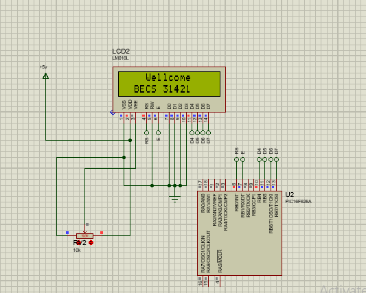

# -Interfacing-a-16-2-LCD-with-a-PIC-Microcontroller
This practical covered the interfacing of a 16×2 LCD to display text and effects using the PIC microcontroller. Students learn about LCD pin configuration, data/command modes, and using MikroC library functions for LCD control, including text scrolling and centering.Started working with LCD display & Microcontrollers.
my-project/
  README.md
  images/
    proteus.png
    

